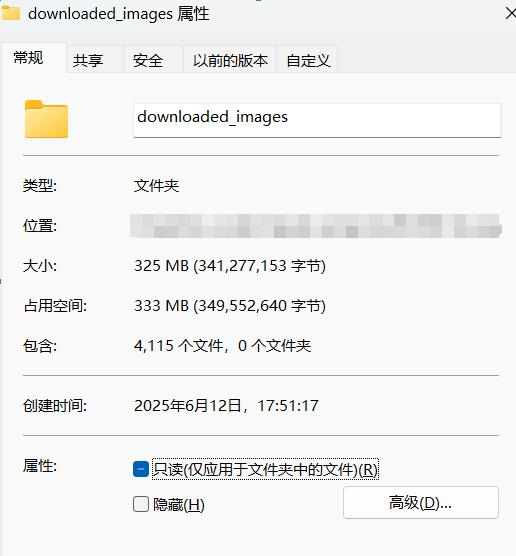
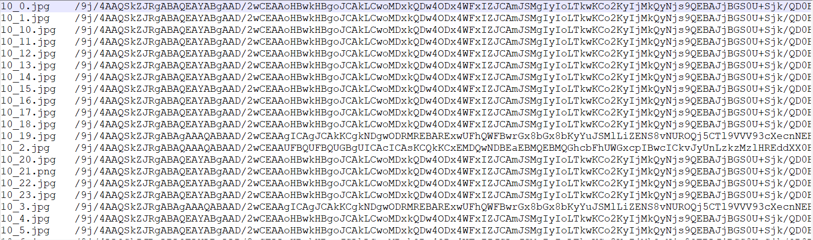

# 记录一次对某SQ网站中图像数据的爬取

| 名称              | 地址                                                                                                     | 备注                      |
| ----------------- | -------------------------------------------------------------------------------------------------------- | ------------------------- |
| downloaded_images | [Google Drive Link](https://drive.google.com/file/d/1Z3DwnewC_IZRvd9dMTpk4haZCArxgxBn/view?usp=drive_link)  | 存储到本地的成人图像数据  |
| images_base64     | [Google Drive Link](https://drive.google.com/file/d/1ThPD2nldNKAohKPV8ykRe8myS7clX5ur/view?usp=drive_link)  | 转换为base64格式的txt文件 |

本项目仅用于深度学习检测模型训练使用！解码密码为*仓库名称*！

内容概述：分页爬取该网站中三个专栏的色情图像。要求保存数据为一个CSV和一个本地图像文件夹。该CSV有两列构成，分别是名称和地址；本地图像文件夹是用于存取图像。

实现效果：在爬取了近4000张图之后，出 现如下错误😅：

```html
ConnectionResetError(10054, '远程主机强迫关闭了一个现有的连接。', None, 10054, None))
```



# 第一部分

用于测试一个爬虫项目：

```python
# Base url BASE_URL = "https://a5c425.com/pic/toupai/"
"""
第二页是"https://a5c425.com/pic/toupai/index_2.html"，第三页是“https://a5c425.com/pic/toupai/index_3.html”.   
我需要爬取每一页中，呈矩阵式排列的图片。通过查看网页源代码，发现，图片信息隐藏在如下HTML标签中，
"""
```

网页源代码如下所示：

```html
<dl>
	<dt><a href="/view/202506/92343.html" target="_blank"><i></i></a></dt>
	<dd><a href="/view/202506/92343.html" target="_blank"><h3><script type="text/javascript">document.write(d('W+WOn+WIm+iHquaLjV3lnZDmoIcwNTEy77yM5YiG5Lqr5aSn5aW26IKl6IeA56a75byC5bCR5aaHIOWbvivop4bpopFbMTBQXVsyVl0='));</script>[原创自拍]坐标0512，分享大奶肥臀离异少妇 图+视频[10P][2V]</h3>
</a></dd>
</dl>
```

**项目需求：**

（1） 将前100页的图片和地址，存储到本地CSV文件；

（2） 将对应的图片保存到本地文件夹.

# 第二部分

将爬取的头像数据转换为Base64代码，并转存为一个txt文件.



# 第三部分

关于图像标题的解密。从网页源代码可以看出，标题被加密了，在后续CSV存储结果中发现也是这样。查看网页源代码，发现：

```html
<script type="text/javascript">document.write(d('加密字符串'));</script>
```

这里的d()是网站自定义的解密函数。通过查找，最终找到如下内容：

```html
<script type="text/javascript">function d(input){rv=window.atob(input);rv=escape(rv);rv=decodeURIComponent(rv);return rv;}</script></head>
```

所以看到，这里使用了atob函数，即利用Base64解码.

因此解密过程为：

* Base64解码；
* 使用escape()编码；
* 使用decodeURIComponent解码。

所以在Python中，可以模拟如下过程：

* TODO
